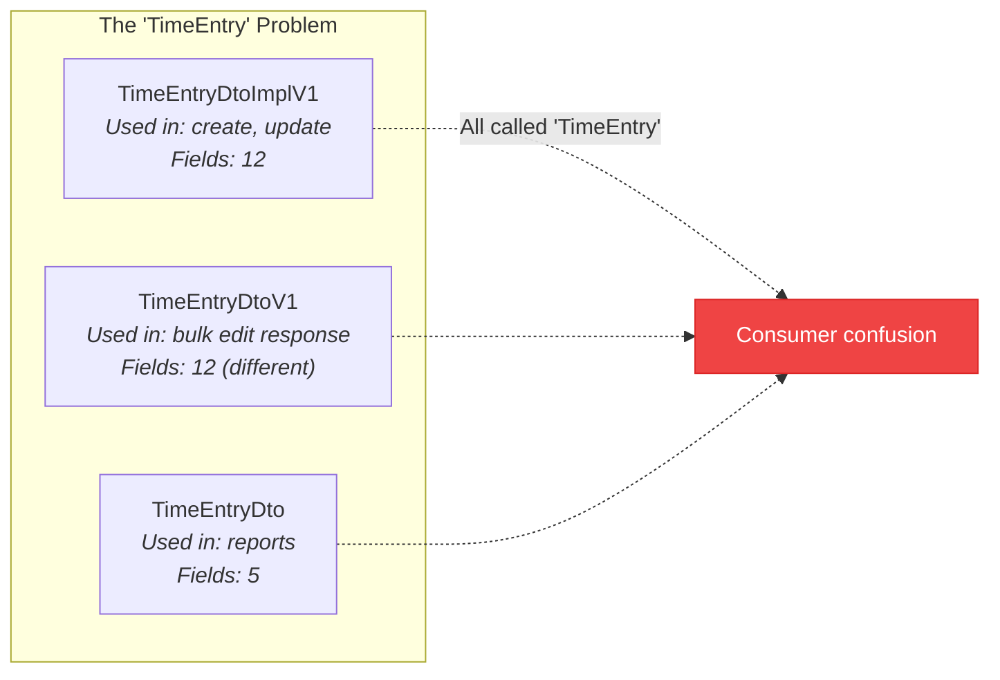

# API Anomalies

This is a living document of every inconsistency, naming collision, and spec divergence we've found in the Clockify REST API. Updated periodically by running the [runtime verifier](/sdk/verification) against live endpoints.

<Callout type="info" title="For the Clockify Team">
  This report is compiled with care. We use the Clockify API heavily and want it to be the best it can be. Every anomaly listed here includes context on why it matters and a suggested resolution.
</Callout>

## Summary

| Category | Count | Severity |
|---|---|---|
| Schema name collisions | 17 | Medium — forces consumers to disambiguate |
| Inconsistent naming conventions | 6 patterns | Low — cosmetic but confusing |
| Return type mismatches | 4 entities | High — different types for create vs. read |
| Nullable fields declared as required objects | 9 fields | High — causes runtime validation failures |
| Undeclared enum values | 3 fields | Medium — responses contain values not in the spec |
| Undocumented response fields | 3 fields | Medium — spec is incomplete |

---

## Schema Name Collisions

The OpenAPI spec defines **17 pairs of schemas** with names that are semantically identical but have different suffixes (`Dto` vs `DtoV1` vs `DtoImplV1`). These schemas have **different field sets**, meaning they represent different views of the same entity — but the naming doesn't communicate this clearly.

### Complete Collision List

| Schemas | Ideal Name | Impact |
|---|---|---|
| `TimeEntryDtoImplV1`, `TimeEntryDtoV1`, `TimeEntryDto` | TimeEntry | **3-way collision** — three different shapes for the same concept |
| `ProjectDtoImplV1`, `ProjectDtoV1` | Project | Create/update returns different shape than get |
| `UserDtoV1`, `UserDto` | User | Full user vs. report-embedded user |
| `RateDto`, `RateDtoV1` | Rate | Different rate representations |
| `TagDto`, `TagDtoV1` | Tag | Report tag vs. full tag |
| `TimeIntervalDto`, `TimeIntervalDtoV1` | TimeInterval | Different interval representations |
| `CustomFieldValueDto`, `CustomFieldValueDtoV1` | CustomFieldValue | Different custom field value shapes |
| `ExpenseCategoryDto`, `ExpenseCategoryDtoV1` | ExpenseCategory | Different category representations |
| `ExpenseHydratedDto`, `ExpenseHydratedDtoV1` | ExpenseHydrated | Different hydrated expense shapes |
| `HolidayDto`, `HolidayDtoV1` | Holiday | Different holiday representations |
| `SharedReportDtoV1`, `SharedReportV1` | SharedReport | DTO wrapper vs. raw report |
| `CostRateRequest`, `CostRateRequestV1` | CostRateRequest | Duplicate request schemas |
| `HourlyRateRequest`, `HourlyRateRequestV1` | HourlyRateRequest | Duplicate request schemas |
| `TaskRequest`, `TaskRequestV1` | TaskRequest | Duplicate request schemas |
| `ContainsUserGroupFilterRequest`, `ContainsUserGroupFilterRequestV1` | ContainsUserGroupFilterRequest | Duplicate filter schemas |
| `UpdateCustomFieldRequest`, `UpdateCustomFieldRequestV1` | UpdateCustomFieldRequest | Duplicate request schemas |
| `UpsertUserCustomFieldRequest`, `UpsertUserCustomFieldRequestV1` | UpsertUserCustomFieldRequest | Duplicate request schemas |

<Callout type="tip" title="Suggested Fix">
  Use descriptive suffixes that communicate purpose: `TimeEntryFull`, `TimeEntryCompact`, `TimeEntryReportView`. Or better, use a single `TimeEntry` type with optional fields and document which endpoints populate which fields.
</Callout>

---

## Inconsistent Naming Patterns

The spec mixes several naming conventions:

| Pattern | Examples | Occurrences |
|---|---|---|
| `{Entity}DtoV1` | `ClientDtoV1`, `TagDtoV1` | Most common |
| `{Entity}DtoImplV1` | `ProjectDtoImplV1`, `TimeEntryDtoImplV1` | "Impl" is a Java implementation detail |
| `{Entity}Dto` | `TimeEntryDto`, `TagDto`, `RateDto` | Older, no version suffix |
| `{Entity}V1` | `SharedReportV1`, `InvoiceInfoV1` | Version without "Dto" |
| `{Action}{Entity}Request` | `CreateClientRequestV1`, `UpdateTagRequest` | Inconsistent V1 suffix |
| `{Action}{Entity}V1Request` | `CreateTimeOffRequestV1Request` | Double naming collision (`Request` appears in entity name) |

<Callout type="warning" title="Leaking Internals">
  The `DtoImplV1` suffix leaks Java implementation details (DTO = Data Transfer Object, Impl = Implementation). API consumers shouldn't need to know about internal class hierarchies.
</Callout>

---

## Return Type Mismatches

Several endpoints return a **different type** for mutation operations (create/update/delete) than for read operations (get/list):

| Entity | GET returns | POST/PUT returns | Issue |
|---|---|---|---|
| Project | `ProjectDtoV1` | `ProjectDtoImplV1` | Different field sets |
| Client | `ClientWithCurrencyDtoV1` | `ClientDtoV1` | GET includes currency, mutations don't |
| Holiday | `HolidayDtoV1` | `HolidayDto` (on delete) | Delete returns older DTO version |
| Time Entry | `TimeEntryWithRatesDtoV1` | `TimeEntryDtoImplV1` | GET includes rates, mutations don't |

This forces API consumers to maintain **two type definitions per entity** and handle the impedance mismatch between reading and writing.

---

## Runtime Divergences

The [runtime verifier](/sdk/verification) checks live API responses against the OpenAPI spec schemas. As of the latest run (March 2026):

| Metric | Count |
|---|---|
| Endpoints checked | 18 |
| Spec divergences (unique fields) | 16 |
| Spec divergences (total across all array items) | 78 |
| Undocumented response fields | 3 |
| Permission-gated endpoints (skipped) | 2 |
| Reality schema checks | 6/6 passing |

### Nullable Fields Declared as Required Objects

The most common divergence. The spec declares these as required non-null objects, but the API returns `null` when they haven't been set:

| Endpoint | Field | Spec says | Actually returns |
|---|---|---|---|
| `GET /workspaces` | `memberships[].costRate` | `object` (required) | `null` |
| `GET /workspaces` | `memberships[].hourlyRate` | `object` (required) | `null` |
| `GET /workspaces` | `subdomain.name` | `string` (required) | `null` |
| `GET /workspaces` | `workspaceSettings.automaticLock` | `object` (required) | `null` |
| `GET /workspaces` | `workspaceSettings.lockTimeEntries` | `string` (required) | `null` |
| `GET /workspaces` | `workspaceSettings.lockTimeZone` | `string` (required) | `null` |
| `GET /workspaces/.../projects` | `budgetEstimate` | `object` (required) | `null` |
| `GET /workspaces/.../projects` | `costRate` | `object` (required) | `null` |
| `GET /workspaces/.../time-entries` | `kioskId` | `string` (required) | `null` |

These affect **every item in every array response** — a single `null` costRate field on workspace memberships produces divergences across every membership in every workspace.

<Callout type="tip" title="Suggested Fix">
  Mark these fields as nullable in the OpenAPI spec (`nullable: true` or use `oneOf` with null). The data model clearly treats them as optional.
</Callout>

### Undeclared Enum Values

The API returns enum values that aren't listed in the spec:

| Endpoint | Field | Spec declares | API also returns |
|---|---|---|---|
| `GET /workspaces` | `features[]` | 64 values (see below) | Additional undeclared feature flags |
| `GET /workspaces` | `workspaceSettings.adminOnlyPages[]` | `PROJECT`, `TEAM`, `REPORTS` | Additional undeclared page values |
| `GET /workspaces/.../projects` | `timeEstimate.resetOption` | `WEEKLY`, `MONTHLY`, `YEARLY` | Empty/null value not in enum |
| `GET /workspaces/.../member-profile` | `workingDays[]` | `MONDAY` through `SUNDAY` | Additional undeclared values |

The `features` enum is the most volatile — Clockify adds new feature flags without updating the spec. The spec lists 64 values, but live responses include additional flags.

<Callout type="tip" title="Suggested Fix">
  Either keep the enum exhaustive and update it with each release, or switch to a `string` type with documented known values. The latter is more forward-compatible.
</Callout>

### Nullable Arrays

| Endpoint | Field | Spec says | Actually returns |
|---|---|---|---|
| `GET /workspaces/.../time-entries` | `tagIds` | `array` (required) | `null` when no tags |

<Callout type="tip" title="Suggested Fix">
  Return an empty array `[]` instead of `null`, or mark the field as nullable.
</Callout>

### Undocumented Response Fields

These fields appear in API responses but are not declared in the OpenAPI spec:

| Endpoint | Field | Type | Sample value | Notes |
|---|---|---|---|---|
| `GET /workspaces/.../projects` | `clientId` | `string` | `""` | Client association — useful but missing from spec |
| `GET /workspaces/.../projects` | `clientName` | `string` | `""` | Denormalized client name |
| `GET /workspaces/.../projects` | `estimateReset` | `null` | `null` | Likely related to `timeEstimate.resetOption` |

All three fields appear on both the list endpoint and the single-project endpoint.

---

### Endpoints Passing Spec Validation

These endpoints return responses that exactly match the OpenAPI spec — no divergences:

| Endpoint | Domain |
|---|---|
| `GET /workspaces/.../clients` | Client |
| `GET /workspaces/.../groups` | Group |
| `GET /workspaces/.../holidays` | Holiday |
| `GET /workspaces/.../tags` | Tag |
| `GET /workspaces/.../projects/.../tasks` | Task |
| `GET /workspaces/.../webhooks` | Webhook |
| `GET /user` | User |
| `GET /workspaces/.../users` | User |

### Permission-Gated Endpoints

These endpoints returned `403 Forbidden` and could not be verified. They require a paid Clockify plan or admin permissions:

| Endpoint | Domain |
|---|---|
| `GET /workspaces/.../custom-fields` | Custom Fields |
| `GET /workspaces/.../time-off/policies` | Time-Off Policies |

---

### Reality Schemas

For every endpoint with known divergences, Clockifixed maintains "reality" override schemas that match what the API **actually** returns. The verifier checks both:

- **Spec schema** — does the response match the OpenAPI spec? (often no)
- **Reality schema** — does the response match our patched schema? (should always pass)

All 6 reality schema checks pass, meaning Clockifixed's override types accurately model the real API behavior even where the spec is wrong.

---

<Callout type="info" title="Contributing">
  Found an anomaly we missed? Run `npm run verify:cli` against your own workspace — different plan tiers and data may surface additional divergences. Document the endpoint, expected behavior, and actual behavior.
</Callout>
