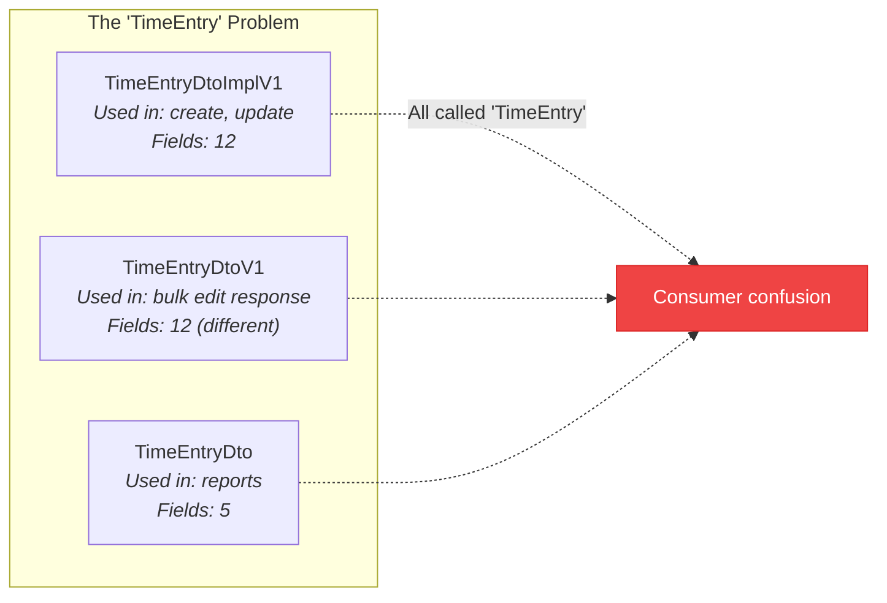

# API Anomalies

This is a living document of every inconsistency, naming collision, and spec divergence we've found in the Clockify REST API. Updated as the [runtime verifier](/sdk/verification) discovers new issues.

<Callout type="info" title="For the Clockify Team">
  This report is compiled with care. We use the Clockify API heavily and want it to be the best it can be. Every anomaly listed here includes context on why it matters and a suggested resolution.
</Callout>

## Summary

| Category | Count | Severity |
|---|---|---|
| Schema name collisions | 17 | Medium — forces consumers to disambiguate |
| Inconsistent naming conventions | Multiple | Low — cosmetic but confusing |
| Return type mismatches | TBD | High — different types for create vs. read |
| Undocumented response fields | TBD | Medium — spec is incomplete |
| Deprecated but undocumented | TBD | Low — unclear migration path |

## Schema Name Collisions

The OpenAPI spec defines **17 pairs of schemas** with names that are semantically identical but have different suffixes (`Dto` vs `DtoV1` vs `DtoImplV1`). These schemas have **different field sets**, meaning they represent different views of the same entity — but the naming doesn't communicate this clearly.

### Complete Collision List

| Schemas | Ideal Name | Impact |
|---|---|---|
| `TimeEntryDtoImplV1`, `TimeEntryDtoV1`, `TimeEntryDto` | TimeEntry | **3-way collision** — three different shapes for the same concept |
| `ProjectDtoImplV1`, `ProjectDtoV1` | Project | Create/update returns different shape than get |
| `UserDtoV1`, `UserDto` | User | Full user vs. report-embedded user |
| `RateDto`, `RateDtoV1` | Rate | Different rate representations |
| `TagDto`, `TagDtoV1` | Tag | Report tag vs. full tag |
| `TimeIntervalDto`, `TimeIntervalDtoV1` | TimeInterval | Different interval representations |
| `CustomFieldValueDto`, `CustomFieldValueDtoV1` | CustomFieldValue | Different custom field value shapes |
| `ExpenseCategoryDto`, `ExpenseCategoryDtoV1` | ExpenseCategory | Different category representations |
| `ExpenseHydratedDto`, `ExpenseHydratedDtoV1` | ExpenseHydrated | Different hydrated expense shapes |
| `HolidayDto`, `HolidayDtoV1` | Holiday | Different holiday representations |
| `SharedReportDtoV1`, `SharedReportV1` | SharedReport | DTO wrapper vs. raw report |
| `CostRateRequest`, `CostRateRequestV1` | CostRateRequest | Duplicate request schemas |
| `HourlyRateRequest`, `HourlyRateRequestV1` | HourlyRateRequest | Duplicate request schemas |
| `TaskRequest`, `TaskRequestV1` | TaskRequest | Duplicate request schemas |
| `ContainsUserGroupFilterRequest`, `ContainsUserGroupFilterRequestV1` | ContainsUserGroupFilterRequest | Duplicate filter schemas |
| `UpdateCustomFieldRequest`, `UpdateCustomFieldRequestV1` | UpdateCustomFieldRequest | Duplicate request schemas |
| `UpsertUserCustomFieldRequest`, `UpsertUserCustomFieldRequestV1` | UpsertUserCustomFieldRequest | Duplicate request schemas |

<Callout type="tip" title="Suggested Fix">
  Use descriptive suffixes that communicate purpose: `TimeEntryFull`, `TimeEntryCompact`, `TimeEntryReportView`. Or better, use a single `TimeEntry` type with optional fields and document which endpoints populate which fields.
</Callout>

## Inconsistent Naming Patterns

The spec mixes several naming conventions:

| Pattern | Examples | Occurrences |
|---|---|---|
| `{Entity}DtoV1` | `ClientDtoV1`, `TagDtoV1` | Most common |
| `{Entity}DtoImplV1` | `ProjectDtoImplV1`, `TimeEntryDtoImplV1` | "Impl" is a Java implementation detail |
| `{Entity}Dto` | `TimeEntryDto`, `TagDto`, `RateDto` | Older, no version suffix |
| `{Entity}V1` | `SharedReportV1`, `InvoiceInfoV1` | Version without "Dto" |
| `{Action}{Entity}Request` | `CreateClientRequestV1`, `UpdateTagRequest` | Inconsistent V1 suffix |
| `{Action}{Entity}V1Request` | `CreateTimeOffRequestV1Request` | Double naming collision (`Request` appears in entity name) |

<Callout type="warning" title="Leaking Internals">
  The `DtoImplV1` suffix leaks Java implementation details (DTO = Data Transfer Object, Impl = Implementation). API consumers shouldn't need to know about internal class hierarchies.
</Callout>

## Return Type Mismatches

Several endpoints return a **different type** for mutation operations (create/update/delete) than for read operations (get/list):

| Entity | GET returns | POST/PUT returns | Issue |
|---|---|---|---|
| Project | `ProjectDtoV1` | `ProjectDtoImplV1` | Different field sets |
| Client | `ClientWithCurrencyDtoV1` | `ClientDtoV1` | GET includes currency, mutations don't |
| Holiday | `HolidayDtoV1` | `HolidayDto` (on delete) | Delete returns older DTO version |
| Time Entry | `TimeEntryWithRatesDtoV1` | `TimeEntryDtoImplV1` | GET includes rates, mutations don't |

This forces API consumers to maintain **two type definitions per entity** and handle the impedance mismatch between reading and writing.

## Runtime Divergences

The [runtime verifier](/sdk/verification) checks live API responses against the OpenAPI spec schemas. As of the latest run against the Clockify API:

| Metric | Count |
|---|---|
| Endpoints checked | 18 |
| Spec divergences found | 78 |
| Undocumented response fields | 6 |
| Permission-gated endpoints (skipped) | 2 |

### Common divergence patterns

- **Wrong types** — fields declared as objects in the spec are actually `null` in responses (e.g., `costRate`, `hourlyRate`, `budgetEstimate`)
- **Invalid enum values** — actual API responses include enum values not declared in the spec (e.g., `features`, `adminOnlyPages`, `resetOption`)
- **Undocumented fields** — responses include fields not in the spec at all (e.g., `clientId`, `clientName`, `estimateReset` on projects)

### Reality schemas

For endpoints with known divergences, Clockifixed maintains "reality" override schemas that match what the API actually returns. The verifier checks both:

- **Spec schema** — does the response match the OpenAPI spec? (often no)
- **Reality schema** — does the response match our patched schema? (should always pass)

Run `npm run verify:cli` to see the full divergence report for your workspace.

---

<Callout type="info" title="Contributing">
  Found an anomaly we missed? The verifier catches these automatically, but manual reports are welcome too. Document the endpoint, expected behavior, and actual behavior.
</Callout>
