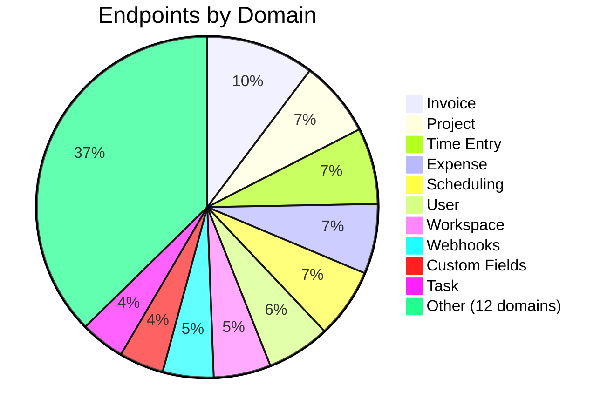

# Clockify API Overview

This section documents the Clockify REST API as defined in their [official OpenAPI 3.0.1 spec](https://docs.clockify.me/openapi.json).

<CardGroup cols={1}>
  <Card title="Interactive API Reference" icon="📡" href="/api-reference">
    Browse all 108 paths, 166 operations, and 277 schemas with a live playground — auto-generated from the OpenAPI spec.
  </Card>
</CardGroup>

## API Surface

| Metric | Value |
|---|---|
| **OpenAPI version** | 3.0.1 |
| **Total paths** | 108 |
| **Total operations** | 166 |
| **Schema definitions** | 277 |
| **GET endpoints** | 50 |
| **POST endpoints** | 48 |
| **PUT endpoints** | 28 |
| **DELETE endpoints** | 24 |
| **PATCH endpoints** | 16 |

## Endpoint Distribution

## Authentication

All requests require either:
- `X-Api-Key` header — your personal API key from [Profile Settings](https://app.clockify.me/user/settings)
- `X-Addon-Token` header — for marketplace addon integrations

## Rate Limiting

- **50 requests/second** per addon per workspace (using `X-Addon-Token`)
- Personal API keys have undocumented limits — Clockifixed defaults to **10 req/s** to be safe

## Base URLs

| Region | Main API | Reports API |
|---|---|---|
| **Global** | `https://api.clockify.me/api/v1` | `https://reports.api.clockify.me/v1` |
| **EU (Germany)** | `https://euc1.clockify.me/api/v1` | — |
| **USA** | `https://use2.clockify.me/api/v1` | — |
| **UK** | `https://euw2.clockify.me/api/v1` | — |
| **Australia** | `https://apse2.clockify.me/api/v1` | — |
| **Developer** | `https://developer.clockify.me/api/v1` | — |

## Pagination

All GET list endpoints support:
- `page` (integer, 1-indexed)
- `page-size` (integer)
- Response header `Last-Page: true/false`

## Endpoint Groups

<CardGroup cols={3}>
  <Card title="User" icon="👤">10 endpoints — profile, members, roles, managers</Card>
  <Card title="Workspace" icon="🏢">9 endpoints — CRUD, rates, user management</Card>
  <Card title="Project" icon="📁">12 endpoints — CRUD, estimates, memberships, rates</Card>
  <Card title="Time Entry" icon="⏱️">12 endpoints — CRUD, bulk edit, timers, duplication</Card>
  <Card title="Client" icon="🤝">5 endpoints — CRUD</Card>
  <Card title="Tag" icon="🏷️">5 endpoints — CRUD</Card>
  <Card title="Task" icon="✅">7 endpoints — CRUD, cost/hourly rates</Card>
  <Card title="Invoice" icon="📄">17 endpoints — CRUD, items, payments, export</Card>
  <Card title="Expense" icon="💰">11 endpoints — CRUD, categories, receipts</Card>
  <Card title="Scheduling" icon="📅">11 endpoints — assignments, recurring, capacity</Card>
  <Card title="Reports" icon="📊">6 endpoints — detailed, summary, weekly, attendance</Card>
  <Card title="Webhooks" icon="🔗">8 endpoints — CRUD, logs, tokens</Card>
</CardGroup>
