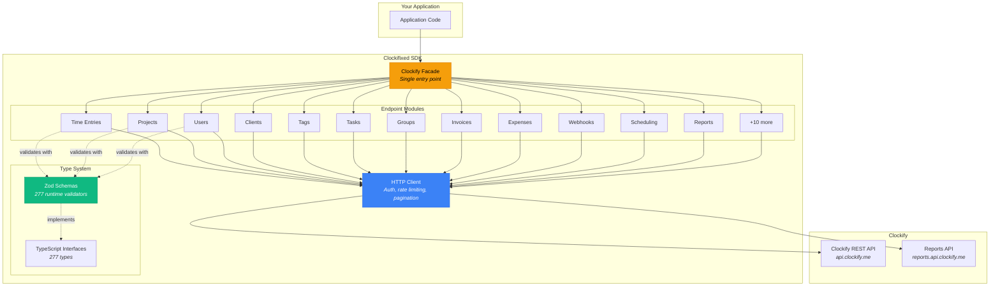

# Architecture

Clockifixed is built in layers, each solving a specific problem in the Clockify API integration story.

## Layer Diagram



## Design Principles

<CardGroup cols={2}>
  <Card title="Spec-Driven" icon="📋">
    Types and schemas are generated from the official OpenAPI spec. The generator handles Clockify's naming inconsistencies automatically.
  </Card>
  <Card title="Runtime-Safe" icon="🛡️">
    Every type has a matching Zod schema. Validate at the boundary, trust internally.
  </Card>
  <Card title="Full Coverage" icon="📡">
    164 methods across 22 endpoint modules. Every documented Clockify operation is wrapped.
  </Card>
  <Card title="Anomaly-Aware" icon="🔍">
    Inconsistencies between spec and reality are tracked, documented, and reported.
  </Card>
</CardGroup>

## Key Components

### Clockify Facade

The main entry point. Can be created with just an API key for discovery, or with a workspace ID for full access:

```typescript
// Discovery mode — workspaces and user info only
const api = new Clockify({ apiKey: "your-key" });
const workspaces = await api.workspaces.getAll();
const me = await api.users.getLoggedUser();

// Full mode — all 22 endpoint modules available
const clockify = api.forWorkspace(workspaces[0].id);
clockify.timeEntries.create({ ... });
clockify.projects.getAll();
```

### HTTP Client

Handles the cross-cutting concerns:

- **Authentication** via `X-Api-Key` header
- **Rate limiting** — configurable requests/second with token bucket
- **Pagination** — `getPaginated()` for single pages, `collectAllPages()` for everything
- **Error handling** — typed errors (`ClockifyApiError`, `ClockifyValidationError`, `ClockifyRateLimitError`)
- **Base URL switching** between main API and Reports API

### Type System

Two layers working together:

| Layer | Purpose | When it runs |
|---|---|---|
| **TypeScript interfaces** | Catch type errors during development | Compile time |
| **Zod schemas** | Validate actual API responses match expected shapes | Runtime |

The Zod schemas are the foundation of the verifier — they let us prove whether Clockify is actually sending what the spec claims.
