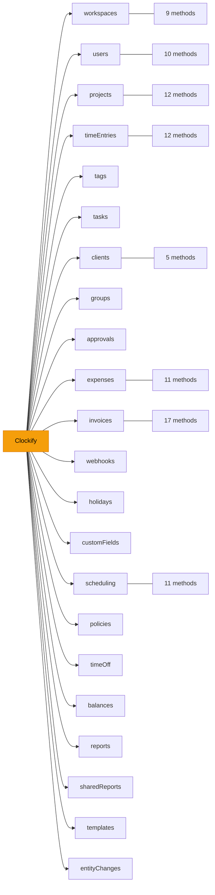

# Endpoint Reference

All endpoints are accessed through the `Clockify` facade. Each domain is a property containing typed methods.

## Endpoint Map

## Complete Method Reference

### `clockify.timeEntries` — Time Entry Operations

| Method | HTTP | Description |
|---|---|---|
| `create(body)` | POST | Add a new time entry |
| `get(id)` | GET | Get a specific time entry |
| `update(id, body)` | PUT | Update a time entry |
| `delete(id)` | DELETE | Delete a time entry |
| `getForUser(userId, params?)` | GET | Get time entries for a user |
| `createForUser(userId, body)` | POST | Add a time entry for another user |
| `stopTimer(userId, body)` | PATCH | Stop a running timer |
| `deleteForUser(userId, timeEntryIds)` | DELETE | Delete specific time entries for a user |
| `bulkEdit(userId, body)` | PUT | Bulk edit time entries (accepts single or array) |
| `duplicate(userId, id)` | POST | Duplicate a time entry |
| `updateInvoicedStatus(body)` | PATCH | Mark entries as invoiced |
| `getInProgress()` | GET | Get all running timers |

### `clockify.projects` — Project Management

| Method | HTTP | Description |
|---|---|---|
| `getAll(params?)` | GET | List all projects |
| `create(body)` | POST | Create a project |
| `createFromTemplate(body)` | POST | Create from template |
| `get(projectId)` | GET | Get project by ID |
| `update(projectId, body)` | PUT | Update a project |
| `delete(projectId)` | DELETE | Delete a project |
| `updateEstimate(projectId, body)` | PATCH | Update project estimate |
| `updateMemberships(projectId, body)` | PATCH | Update memberships |
| `addUsers(projectId, body)` | POST | Assign users to project |
| `updateTemplate(projectId, body)` | PATCH | Update template flag |
| `setUserCostRate(projectId, userId, body)` | PUT | Set user's cost rate |
| `setUserHourlyRate(projectId, userId, body)` | PUT | Set user's hourly rate |

### `clockify.users` — User Operations

| Method | HTTP | Description |
|---|---|---|
| `getLoggedUser()` | GET | Get current user info |
| `getAll(params?)` | GET | List workspace users |
| `filter(body)` | POST | Filter users with criteria |
| `getMemberProfile(userId)` | GET | Get member profile |
| `updateMemberProfile(userId, body)` | PATCH | Update member profile |
| `upsertCustomFieldValue(userId, cfId, body)` | PUT | Set user custom field |
| `getManagers(userId)` | GET | Get user's managers |
| `createRole(userId, body)` | POST | Assign manager role |
| `deleteRole(userId, body)` | DELETE | Remove manager role |
| `uploadImage(body)` | POST | Upload profile photo |

### `clockify.invoices` — Invoice Management

| Method | HTTP | Description |
|---|---|---|
| `getAll(params?)` | GET | List invoices |
| `create(body)` | POST | Create an invoice |
| `get(invoiceId)` | GET | Get invoice by ID |
| `update(invoiceId, body)` | PUT | Update an invoice |
| `delete(invoiceId)` | DELETE | Delete an invoice |
| `duplicate(invoiceId)` | POST | Duplicate an invoice |
| `export(invoiceId)` | GET | Export an invoice |
| `getInfo(body)` | POST | Filter invoices |
| `addItem(invoiceId, body)` | POST | Add line item |
| `importTimeEntriesAndExpenses(invoiceId, body)` | POST | Import entries to invoice |
| `removeItem(invoiceId, order)` | DELETE | Remove line item |
| `getPayments(invoiceId)` | GET | List payments |
| `createPayment(invoiceId, body)` | POST | Add payment |
| `deletePayment(invoiceId, paymentId)` | DELETE | Remove payment |
| `changeStatus(invoiceId, body)` | PATCH | Change invoice status |
| `getSettings()` | GET | Get invoice settings |
| `updateSettings(body)` | PUT | Update invoice settings |

### `clockify.expenses` — Expense Tracking

| Method | HTTP | Description |
|---|---|---|
| `getAll(params?)` | GET | List expenses |
| `create(body)` | POST | Create an expense |
| `get(expenseId)` | GET | Get expense by ID |
| `update(expenseId, body)` | PUT | Update an expense |
| `delete(expenseId)` | DELETE | Delete an expense |
| `downloadReceipt(expenseId, fileId)` | GET | Download receipt file |
| `getCategories()` | GET | List expense categories |
| `createCategory(body)` | POST | Create category |
| `updateCategory(catId, body)` | PUT | Update category |
| `deleteCategory(catId)` | DELETE | Delete category |
| `archiveCategory(catId, body)` | PATCH | Archive category |

### Other Endpoint Modules

| Module | Methods | Key Operations |
|---|---|---|
| `workspaces` | 9 | CRUD, rates, user management |
| `clients` | 5 | CRUD |
| `tags` | 5 | CRUD |
| `tasks` | 7 | CRUD, cost/hourly rates |
| `groups` | 6 | CRUD, add/remove users |
| `approvals` | 6 | Submit, resubmit, update status |
| `webhooks` | 8 | CRUD, logs, token regeneration |
| `holidays` | 5 | CRUD, period queries |
| `customFields` | 7 | CRUD, project defaults |
| `scheduling` | 11 | Assignments, recurring, capacity |
| `policies` | 6 | Time-off policies CRUD |
| `timeOff` | 5 | Time-off requests, status changes |
| `balances` | 3 | Time-off balance queries |
| `reports` | 6 | Detailed, summary, weekly, attendance, expense, audit |
| `sharedReports` | 5 | CRUD |
| `templates` | 5 | CRUD *(deprecated)* |
| `entityChanges` | 3 | Created/updated/deleted tracking *(experimental)* |
