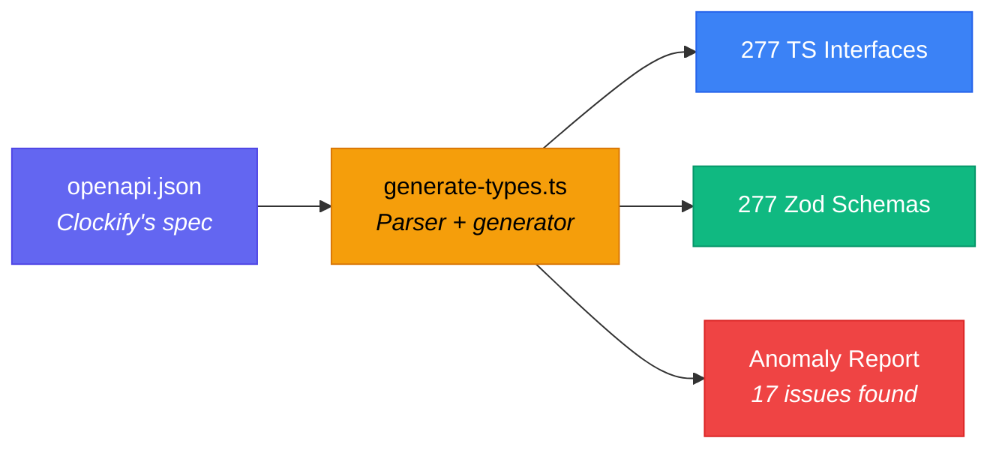
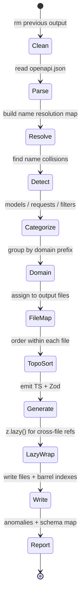
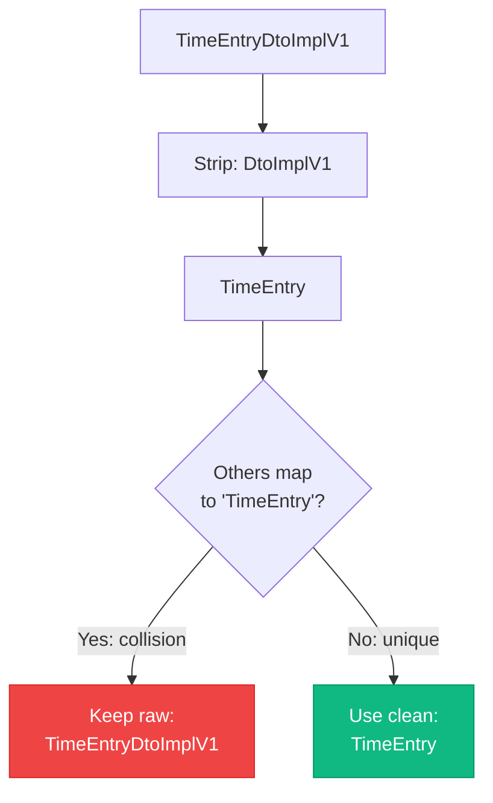
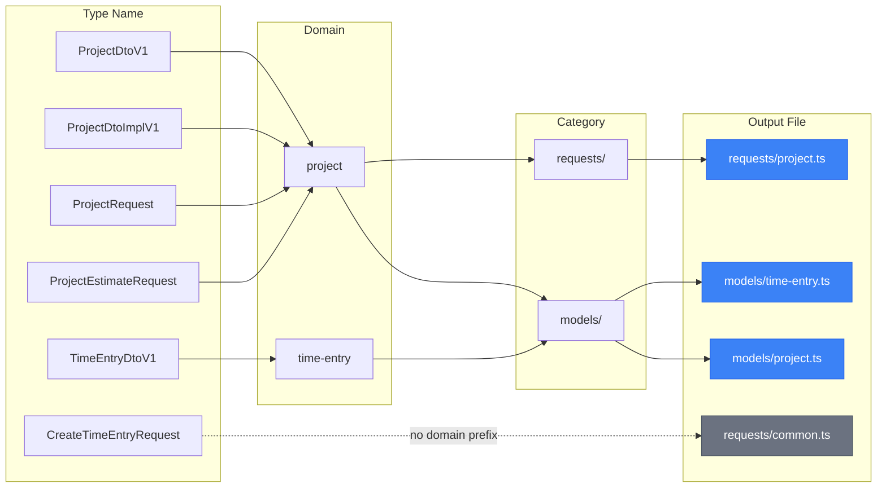

# Type System

Clockifixed has a two-layer type system: **TypeScript interfaces** for compile-time safety and **Zod schemas** for runtime validation. Both are auto-generated from Clockify's OpenAPI spec.

## Generation Pipeline



## File Organization

Types are organized by **category** and **domain**:

```text
src/types/
├── models/           # Entity types (what the API returns)
│   ├── time-entry.ts    # TimeEntryDtoImplV1, TimeEntryDtoV1, ...
│   ├── project.ts       # ProjectDtoImplV1, ProjectDtoV1
│   ├── user.ts          # UserDtoV1, UserDto, UserRedacted, ...
│   ├── client.ts        # Client, ClientWithCurrency
│   ├── invoice.ts       # InvoiceOverview, InvoicesList, ...
│   ├── expense.ts       # Expense, ExpensesAndTotals, ...
│   └── ... (30 files)
├── requests/         # Request body types (what you send)
│   ├── common.ts        # CreateTimeEntryRequest, UpdateProjectRequest, ...
│   ├── invoice.ts       # CreateInvoiceRequest, InvoiceFilterRequest, ...
│   └── ... (19 files)
├── filters/          # Report and query filter types
│   ├── common.ts        # DetailedReportFilter, SummaryReportFilter, ...
│   ├── report.ts        # ReportFilter, WeeklyReportFilter, ...
│   └── ... (6 files)
└── index.ts          # Barrel export — import everything from here
```

## Unified Types

Clockify defines multiple schemas for the same entity — different fields depending on which endpoint you call. For example, `projects.getAll()` returns `ProjectDtoV1` while `projects.create()` returns `ProjectDtoImplV1`, with different field sets.

Clockifixed solves this. Every endpoint returns a **unified type** that merges all variants into a single superset:

| You import | Clockify's raw schemas it replaces | How it works |
|---|---|---|
| `Project` | `ProjectDtoV1` (GET), `ProjectDtoImplV1` (POST/PUT) | Superset — variant-specific fields optional |
| `TimeEntry` | `TimeEntryDtoImplV1` (write), `TimeEntryWithRates` (GET), `TimeEntryDtoV1` (bulk) | Superset — rate fields optional |
| `ClockifyClient` | `ClientWithCurrency` (GET), `Client` (PUT/DELETE) | Superset — `currencyCode` optional |
| `Holiday` | `HolidayDtoV1` (GET/create), `HolidayDto` (delete) | Superset — handles type differences |
| `Tag` | `TagDtoV1` | Clean alias |
| `User` | `UserDtoV1` | Clean alias |
| `ExpenseCategory` | `ExpenseCategoryDtoV1` | Clean alias |
| `ReportTimeEntry` | `TimeEntryDto` | Separate shape for report responses |

You never need to think about which variant the API returns — a `Project` is a `Project`.

## Using Types

Import the clean unified types:

```typescript
import type {
  Project,
  TimeEntry,
  ClockifyClient,
  Tag,
  User,
  CreateTimeEntryRequest,
} from "clockifixed";
```

The raw OpenAPI names (`ProjectDtoV1`, `TimeEntryDtoImplV1`, etc.) are still exported for backward compatibility.

## Using Zod Schemas

Unified Zod schemas accept all variant payloads:

```typescript
import {
  projectSchema,
  timeEntrySchema,
  clockifyClientSchema,
} from "clockifixed";

// Validate unknown data
const result = workspaceSchema.safeParse(apiResponse);
if (result.success) {
  const workspace = result.data; // typed as Workspace
} else {
  console.error(result.error.issues);
}
```

## Circular Reference Handling

Some Clockify schemas are self-referencing (e.g., `GroupOne.children` is `GroupOne[]`). The generator handles these with `z.lazy()`:

```typescript
// Generated automatically
export const groupOneSchema: z.ZodType<GroupOne> = z.lazy(() =>
  z.object({
    children: z.array(groupOneSchema).optional(),
    // ...
  })
);
```

Cross-file references also use `z.lazy()` to prevent circular import deadlocks at runtime.

## Regenerating Types

If the OpenAPI spec is updated:

```bash
npm run generate
```

This cleans previous output (preserving test files), regenerates all types and schemas, and reports any new anomalies.

## Generator Internals

The generator (`scripts/generate-types.ts`) is the heart of the type system. Here's how it transforms 277 OpenAPI schemas into TypeScript + Zod.

### Pipeline Stages



### Name Resolution

The biggest challenge is Clockify's inconsistent naming. The spec has:

- `TimeEntryDtoImplV1` — an implementation detail DTO
- `TimeEntryDtoV1` — a V1-versioned DTO
- `TimeEntryDto` — a plain DTO

All three represent "time entry" shapes with different fields. The generator:

1. Strips suffixes (`DtoImplV1`, `DtoV1`, `Dto`, `V1`) to get an ideal name
2. Detects when multiple schemas map to the same ideal name
3. Falls back to preserving the raw OpenAPI name for colliding schemas
4. Uses the clean name when there's no collision



### Domain Grouping

Types are grouped into files by domain prefix:



### Topological Sort

Within each output file, schemas are sorted so dependencies come before dependents. For self-referencing schemas (like `GroupOne.children: GroupOne[]`), the generator wraps the Zod schema in `z.lazy()`.

### Output Statistics

| Metric | Count |
|---|---|
| Total schemas processed | 277 |
| TypeScript interfaces generated | 277 |
| Zod schemas generated | 277 |
| Model files | 27 |
| Request files | 16 |
| Filter files | 7 |
| Name collisions detected | 17 |
| Cross-file `z.lazy()` wraps | ~50+ |
