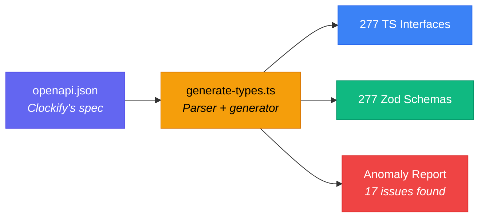

# Type System

Clockifixed has a two-layer type system: **TypeScript interfaces** for compile-time safety and **Zod schemas** for runtime validation. Both are auto-generated from Clockify's OpenAPI spec.

## Generation Pipeline



## File Organization

Types are organized by **category** and **domain**:

```text
src/types/
├── models/           # Entity types (what the API returns)
│   ├── time-entry.ts    # TimeEntryDtoImplV1, TimeEntryDtoV1, ...
│   ├── project.ts       # ProjectDtoImplV1, ProjectDtoV1
│   ├── user.ts          # UserDtoV1, UserDto, UserRedacted, ...
│   ├── client.ts        # Client, ClientWithCurrency
│   ├── invoice.ts       # InvoiceOverview, InvoicesList, ...
│   ├── expense.ts       # Expense, ExpensesAndTotals, ...
│   └── ... (30 files)
├── requests/         # Request body types (what you send)
│   ├── common.ts        # CreateTimeEntryRequest, UpdateProjectRequest, ...
│   ├── invoice.ts       # CreateInvoiceRequest, InvoiceFilterRequest, ...
│   └── ... (19 files)
├── filters/          # Report and query filter types
│   ├── common.ts        # DetailedReportFilter, SummaryReportFilter, ...
│   ├── report.ts        # ReportFilter, WeeklyReportFilter, ...
│   └── ... (6 files)
└── index.ts          # Barrel export — import everything from here
```

## Name Collision Handling

Clockify defines multiple schemas that reduce to the same name after suffix stripping. The generator detects and resolves these:

| Collision Group | Raw OpenAPI Names | Our Type Names |
|---|---|---|
| TimeEntry | `TimeEntryDtoImplV1`, `TimeEntryDtoV1`, `TimeEntryDto` | `TimeEntryDtoImplV1`, `TimeEntryDtoV1`, `TimeEntryDto` |
| Rate | `RateDto`, `RateDtoV1` | `RateDto`, `RateDtoV1` |
| Tag | `TagDto`, `TagDtoV1` | `TagDto`, `TagDtoV1` |
| User | `UserDtoV1`, `UserDto` | `UserDtoV1`, `UserDto` |
| Holiday | `HolidayDto`, `HolidayDtoV1` | `HolidayDto`, `HolidayDtoV1` |
| CustomFieldValue | `CustomFieldValueDto`, `CustomFieldValueDtoV1` | `CustomFieldValueDto`, `CustomFieldValueDtoV1` |

<Callout type="info" title="Naming Rule">
  When a schema name is **unique** after stripping `Dto`, `DtoV1`, `DtoImplV1`, `V1` suffixes, we use the clean name (e.g., `WorkspaceDtoV1` becomes `Workspace`). When there's a **collision**, we preserve the raw OpenAPI name to avoid ambiguity — but provide **unified types** on top.
</Callout>

## Unified Types

Clockifixed solves the collision problem with unified response types. Instead of dealing with `ProjectDtoV1` vs `ProjectDtoImplV1`, you just use `Project`:

| Unified type | Replaces | What it does |
|---|---|---|
| `Project` | `ProjectDtoV1`, `ProjectDtoImplV1` | Superset of both — all fields, variant-specific ones optional |
| `TimeEntry` | `TimeEntryDtoImplV1`, `TimeEntryDtoV1`, `TimeEntryWithRates` | Superset of all 3 — includes rate fields when present |
| `ClockifyClient` | `Client`, `ClientWithCurrency` | Superset — `currencyCode` optional |
| `Holiday` | `HolidayDtoV1`, `HolidayDto` | Superset — handles boolean vs object `automaticTimeEntryCreation` |
| `Tag` | `TagDtoV1` | Clean alias |
| `User` | `UserDtoV1` | Clean alias |
| `ExpenseCategory` | `ExpenseCategoryDtoV1` | Clean alias |
| `ReportTimeEntry` | `TimeEntryDto` | Clean alias (separate shape for report responses) |

Every endpoint method returns the unified type. You never need to think about which variant the API returns.

## Using Types

Import the clean unified types:

```typescript
import type {
  Project,
  TimeEntry,
  ClockifyClient,
  Tag,
  User,
  CreateTimeEntryRequest,
} from "clockifixed";
```

The raw OpenAPI names (`ProjectDtoV1`, `TimeEntryDtoImplV1`, etc.) are still exported for backward compatibility.

## Using Zod Schemas

Unified Zod schemas accept all variant payloads:

```typescript
import {
  projectSchema,
  timeEntrySchema,
  clockifyClientSchema,
} from "clockifixed";

// Validate unknown data
const result = workspaceSchema.safeParse(apiResponse);
if (result.success) {
  const workspace = result.data; // typed as Workspace
} else {
  console.error(result.error.issues);
}
```

## Circular Reference Handling

Some Clockify schemas are self-referencing (e.g., `GroupOne.children` is `GroupOne[]`). The generator handles these with `z.lazy()`:

```typescript
// Generated automatically
export const groupOneSchema: z.ZodType<GroupOne> = z.lazy(() =>
  z.object({
    children: z.array(groupOneSchema).optional(),
    // ...
  })
);
```

Cross-file references also use `z.lazy()` to prevent circular import deadlocks at runtime.

## Regenerating Types

If the OpenAPI spec is updated:

```bash
npm run generate
```

This cleans previous output (preserving test files), regenerates all types and schemas, and reports any new anomalies.
