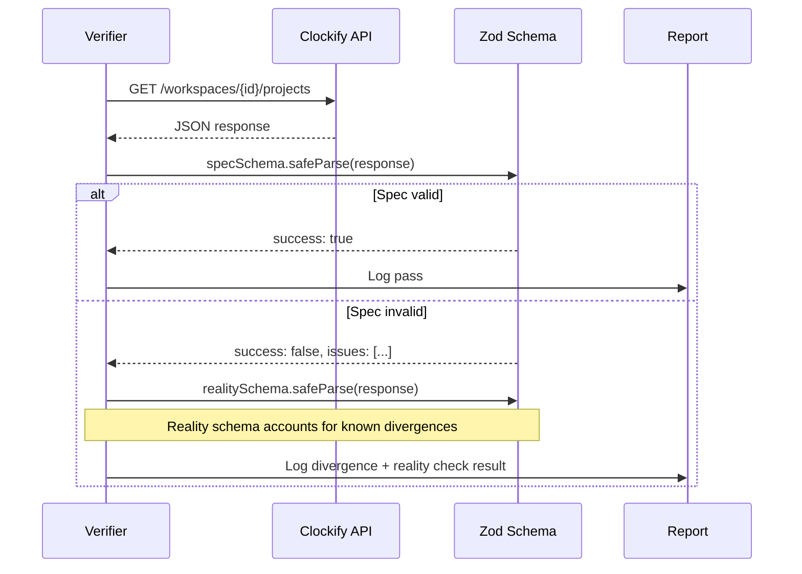

# Verification System

Clockifixed includes a verification layer that hits live Clockify endpoints and validates the actual responses against our Zod schemas. This catches spec-vs-reality divergences that static analysis can't.

## Coverage

| Suite | What it tests | Checks |
|---|---|---|
| **Read verifier** | Every GET endpoint — response schemas | 45 endpoints |
| **Write harness** | Create/update/delete lifecycles — request + response schemas | 100 tests across 17 domains |
| **Reality schemas** | Patched schemas that match what the API actually returns | 37/37 passing |

**87% method coverage** — 143 of 164 library methods are tested against the live API. The remaining 21 are documented gaps requiring multipart upload, complex entity orchestration, or features unavailable on the test workspace.

## How It Works



## What Gets Verified

| Check | Description |
|---|---|
| **Response shape** | Does the JSON match the declared schema? |
| **Field types** | Is `id` a string? Is `billable` a boolean? |
| **Required fields** | Are declared required fields actually present? |
| **Enum values** | Do enum fields contain only declared values? |
| **Nested objects** | Do nested structures match their declared schemas? |
| **Array contents** | Are array items the right type? |
| **Undocumented fields** | What fields come back that aren't in the spec? |
| **Write responses** | Do create/update/delete return the expected types? |
| **Lifecycle correctness** | Create → read back → update → read back → delete → verify gone |

## Running Verification

```bash
# Read-only verification (GET endpoints)
npm run verify            # As test suite
npm run verify:cli        # Full report output

# Write verification (creates/updates/deletes test data, then cleans up)
npm run verify:write

# Filter read verifier by domain
CLOCKIFY_API_KEY=... npx tsx scripts/verify.ts --tag Project
```

<Callout type="warning" title="Live API">
  The verifier makes real API calls. The read verifier is safe (GET only). The write harness creates test entities prefixed with `_cfix_test_`, validates responses, then cleans up. It uses a LIFO cleanup registry to handle failures gracefully.
</Callout>

## Write Harness

The write harness tests the full lifecycle of every entity type:

1. **Create** — call the endpoint, validate response schema
2. **Read back** — GET the created entity, verify it matches
3. **Update** — modify the entity, validate response schema
4. **Delete** — remove the entity (archiving first where Clockify requires it)
5. **Verify gone** — confirm the entity returns 404

Entities are created in dependency order (clients before projects, projects before tasks) and cleaned up in reverse order. All test data uses a `_cfix_test_` prefix for orphan detection.

## Coverage Gaps

21 methods (13%) are not tested against the live API:

| Reason | Methods | Examples |
|---|---|---|
| Multipart upload required | 3 | `expenses.create`, `expenses.update`, `expenses.delete` |
| Endpoint not available | 3 | `sharedReports.create/update/delete` (returns 404) |
| Complex entity setup needed | 7 | Approval create-for-user, scheduling copy/update, time-off create-for-user |
| Needs external user | 2 | `workspace.addUsers`, `time-entries.deleteAllForUser` |
| Other | 6 | Invoice advanced ops, template update, project from-template, balances update |

## Divergence Report

Every divergence is logged with:
- The endpoint that was hit
- The expected schema
- The actual response data
- Specific Zod validation errors
- Whether it's a missing field, wrong type, or undocumented field

These divergences feed directly into the [Anomalies Report](/api/anomalies).
