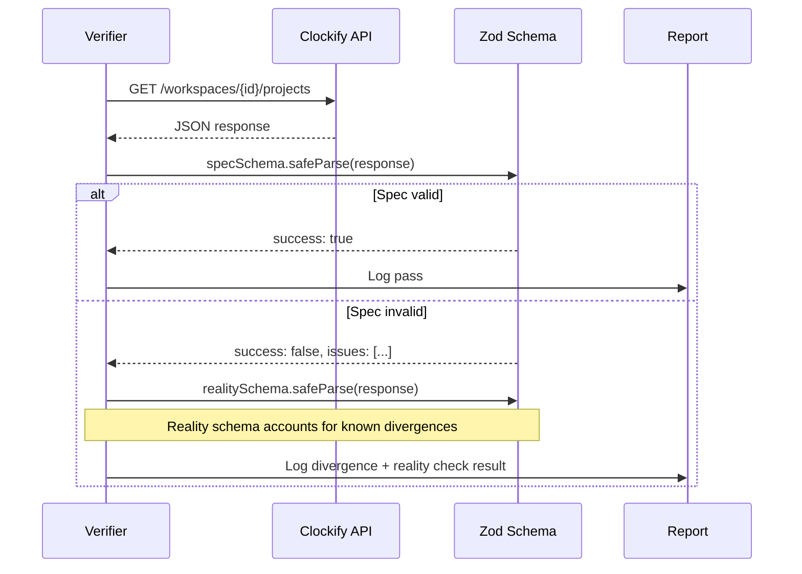

# Verification System

Clockifixed includes a verification layer that hits live Clockify endpoints and validates the actual responses against our Zod schemas. This catches spec-vs-reality divergences that static analysis can't.

## Coverage

| Suite | What it tests | Checks |
|---|---|---|
| **Read verifier** | Every GET endpoint — response schemas | 45 endpoints (40 active with populated data) |
| **Write harness** | Create/update/delete lifecycles — request + response schemas | 114 tests across 17 domains |
| **Reality schemas** | Patched schemas that match what the API actually returns | 41/41 passing (16 read + 25 write) |

**100% method coverage** — all 164 library methods are tested against the live API. The write harness populates the workspace with test data, then runs the read verifier against it before cleanup to ensure every GET endpoint has real data to validate.

## How It Works



## What Gets Verified

| Check | Description |
|---|---|
| **Response shape** | Does the JSON match the declared schema? |
| **Field types** | Is `id` a string? Is `billable` a boolean? |
| **Required fields** | Are declared required fields actually present? |
| **Enum values** | Do enum fields contain only declared values? |
| **Nested objects** | Do nested structures match their declared schemas? |
| **Array contents** | Are array items the right type? |
| **Undocumented fields** | What fields come back that aren't in the spec? |
| **Write responses** | Do create/update/delete return the expected types? |
| **Lifecycle correctness** | Create, read back, update, read back, delete, verify gone |

## Running Verification

```bash
# Read-only verification (GET endpoints)
npm run verify            # As test suite
npm run verify:cli        # Full report output

# Write verification (creates test data, runs read verifier, then cleans up)
npm run verify:write

# Filter read verifier by domain
CLOCKIFY_API_KEY=... npx tsx scripts/verify.ts --tag Project
```

<Callout type="warning" title="Live API">
  The verifier makes real API calls. The read verifier is safe (GET only). The write harness creates test entities prefixed with `_cfix_test_`, validates responses, runs the read verifier against the populated data, then cleans up. It uses a LIFO cleanup registry to handle failures gracefully.
</Callout>

## Write Harness

The write harness tests the full lifecycle of every entity type:

1. **Create** — call the endpoint, validate response schema
2. **Read back** — GET the created entity, verify it matches
3. **Update** — modify the entity, validate response schema
4. **Delete** — remove the entity (archiving first where Clockify requires it)
5. **Verify gone** — confirm the entity returns 404
6. **Read verifier** — after all write tests, run every GET endpoint against the populated workspace

Entities are created in dependency order (clients before projects, projects before tasks) and cleaned up in reverse order. All test data uses a `_cfix_test_` prefix for orphan detection.

## Read Verifier Skips

5 of 45 GET checks are skipped due to infrastructure limits:

| Endpoint | Reason |
|---|---|
| Scheduling project/user totals (2) | Empty response — assignments don't persist between test phases |
| Shared reports list/get (2) | Endpoint returns 404 on this workspace plan |
| Template get by ID (1) | Templates API is deprecated, create silently fails |

## Divergence Report

Every divergence is logged with:
- The endpoint that was hit
- The expected schema
- The actual response data
- Specific Zod validation errors
- Whether it's a missing field, wrong type, or undocumented field

These divergences feed directly into the [Anomalies Report](/api/anomalies).
