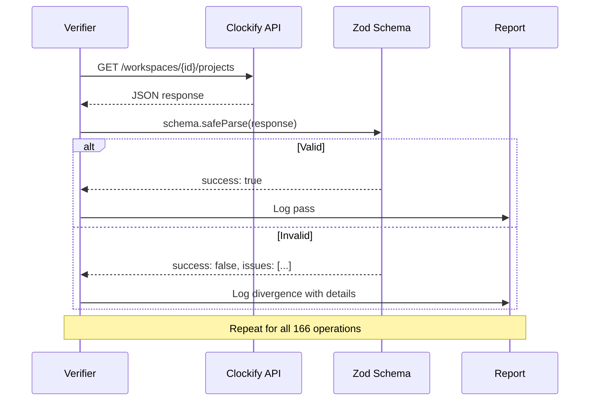

# Verification System

Clockifixed includes a verification layer that hits live Clockify endpoints and validates the actual responses against our Zod schemas. This catches spec-vs-reality divergences that static analysis can't.

## How It Works



## What Gets Verified

| Check | Description |
|---|---|
| **Response shape** | Does the JSON match the declared schema? |
| **Field types** | Is `id` a string? Is `billable` a boolean? |
| **Required fields** | Are declared required fields actually present? |
| **Enum values** | Do enum fields contain only declared values? |
| **Nested objects** | Do nested structures match their declared schemas? |
| **Array contents** | Are array items the right type? |
| **Undocumented fields** | What fields come back that aren't in the spec? |

## Running Verification

```bash
# Run as a test suite (asserts zero errors)
npm run verify

# Run as a CLI tool (full report output)
CLOCKIFY_API_KEY=... npm run verify:cli

# Filter by domain tag
CLOCKIFY_API_KEY=... npx tsx scripts/verify.ts --tag Project
```

<Callout type="warning" title="Live API">
  The verifier makes real API calls. You need a valid API key and workspace with data. Read-only endpoints (GET) are safe, but be careful with write endpoints.
</Callout>

## Divergence Report

Every divergence is logged with:
- The endpoint that was hit
- The expected schema
- The actual response data
- Specific Zod validation errors
- Whether it's a missing field, wrong type, or undocumented field

These divergences feed directly into the [Anomalies Report](/api/anomalies).
