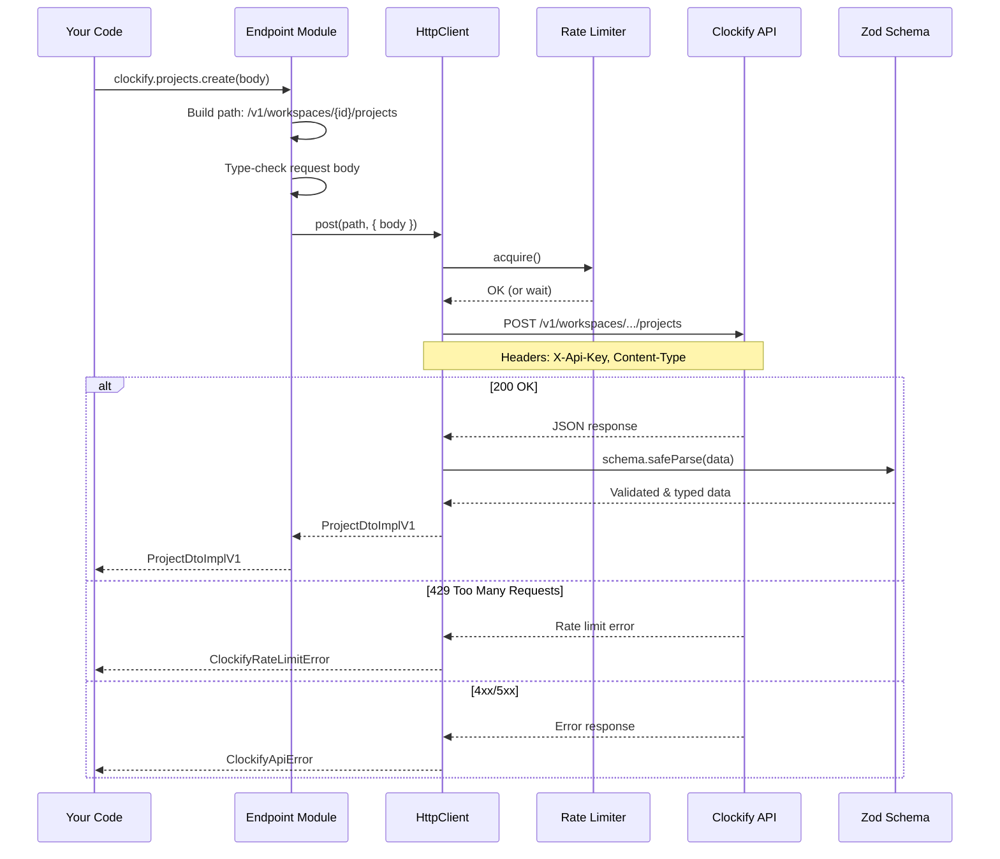
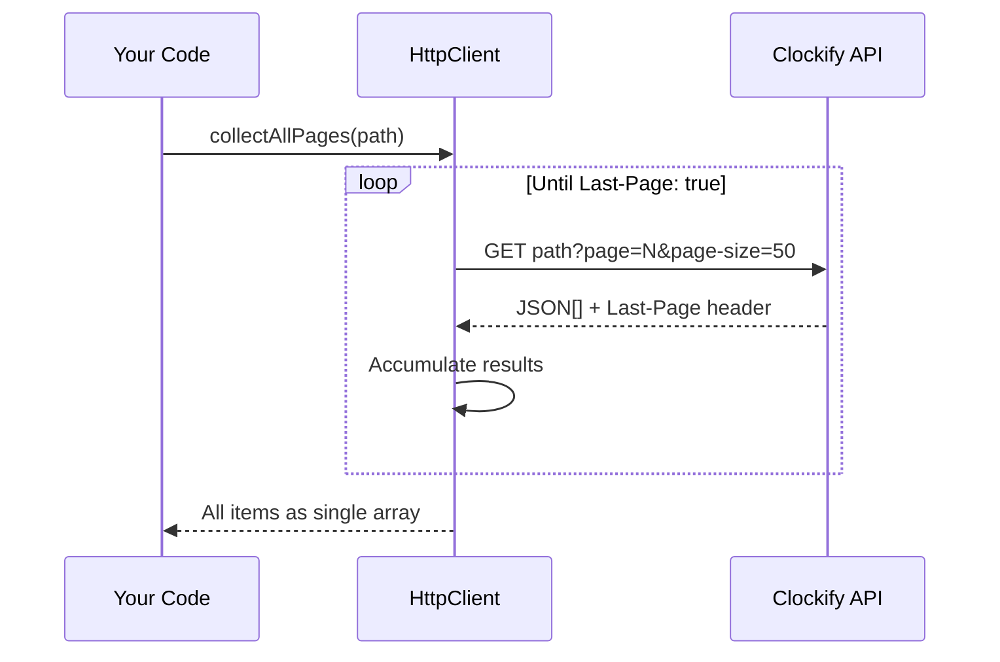
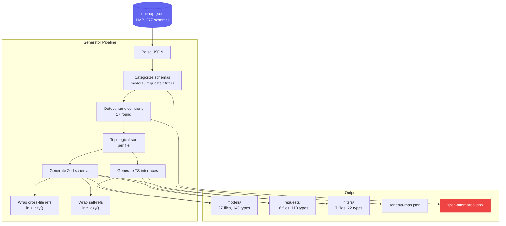
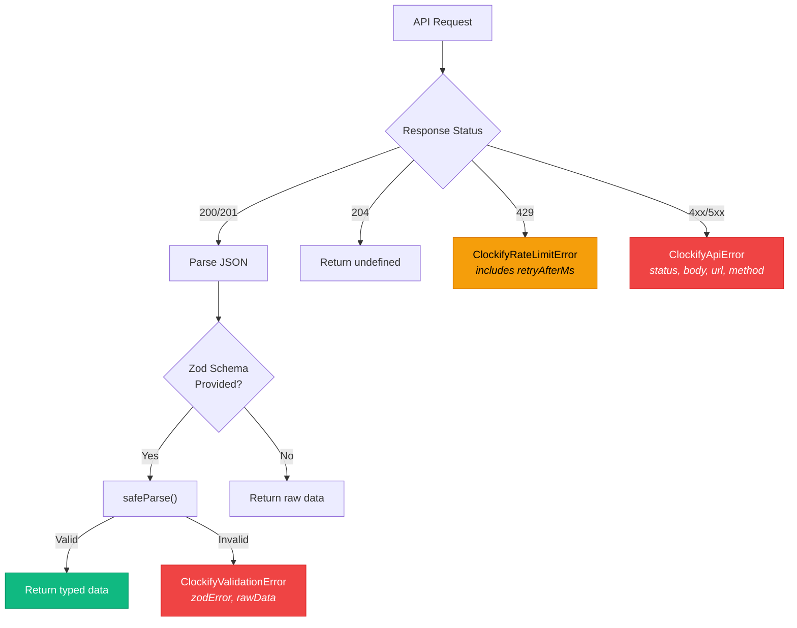
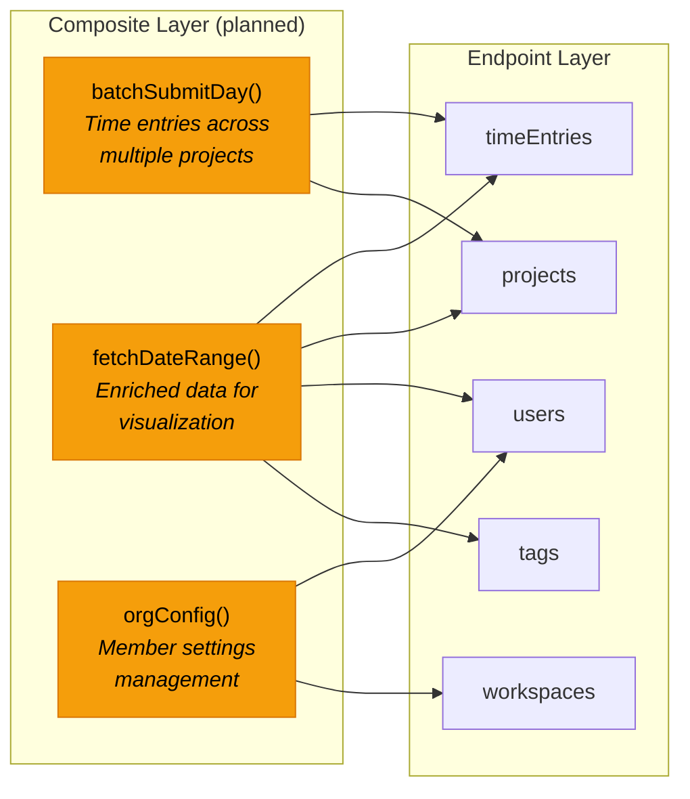

# Data Flow

## Request Lifecycle

Every API call flows through the same pipeline:

## Pagination Flow

For paginated endpoints, the auto-paginator handles multi-page collection:

## Type Generation Flow

Types are generated from the OpenAPI spec, not hand-written:

## Error Handling Flow

## Planned: Composite Operations

Future composite operations will layer on top of the raw endpoints:

