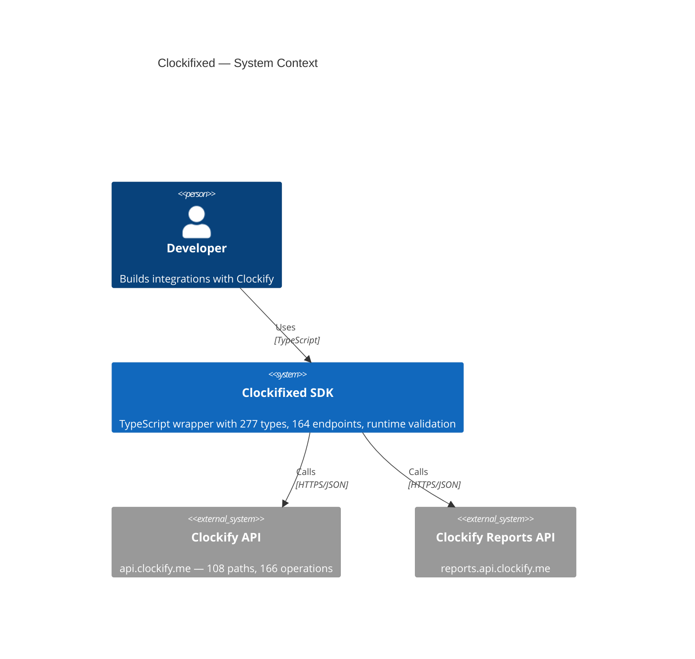
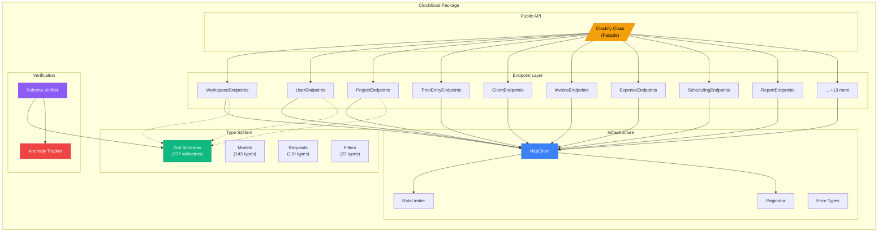
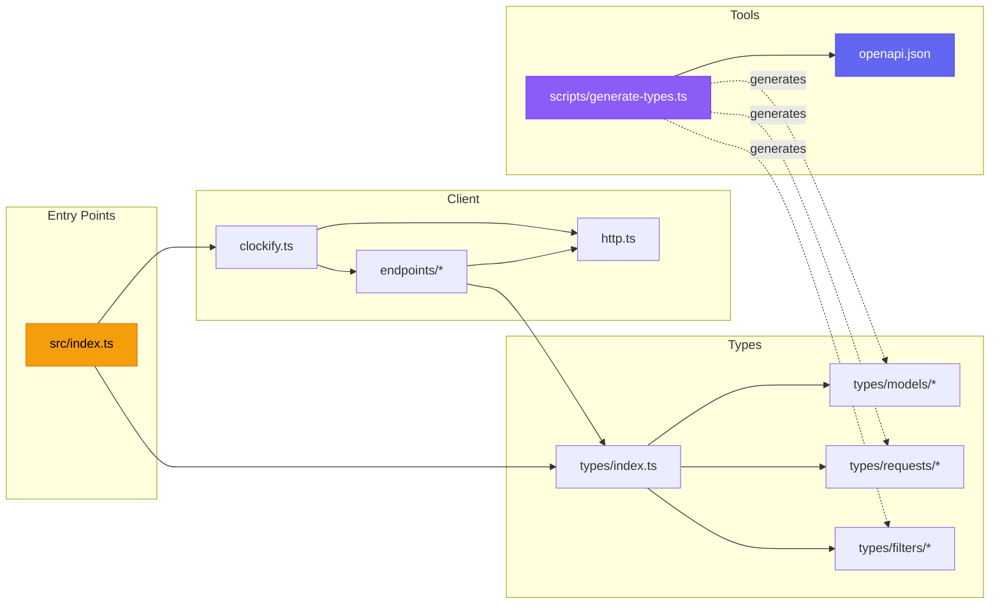

# System Overview

Clockifixed sits between your application and Clockify's REST API, providing type safety, validation, and normalization.

## System Context

## Component Architecture

## Module Dependency Graph

## Technology Stack

| Layer | Technology | Purpose |
|---|---|---|
| Language | TypeScript 5.x | Type safety, IDE support |
| Runtime validation | Zod 4.x | Schema validation, parsing |
| Testing | Vitest 4.x | Unit tests, verification suite |
| HTTP | Native `fetch` | No dependencies, Node 20+ |
| Spec source | OpenAPI 3.0.1 | Clockify's official spec |
| Documentation | Tome | This site |
