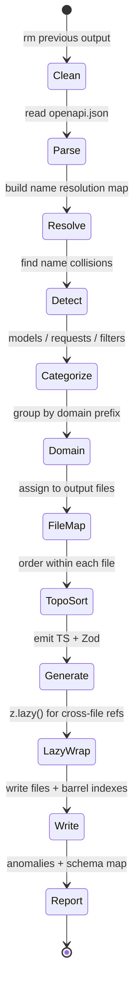
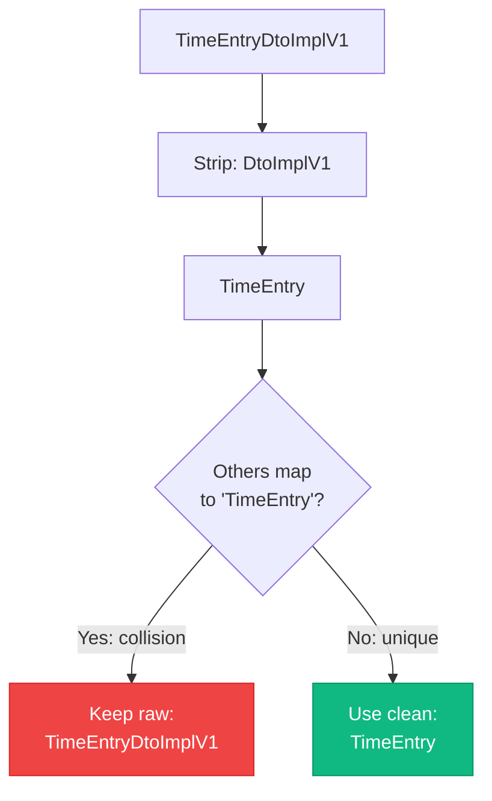
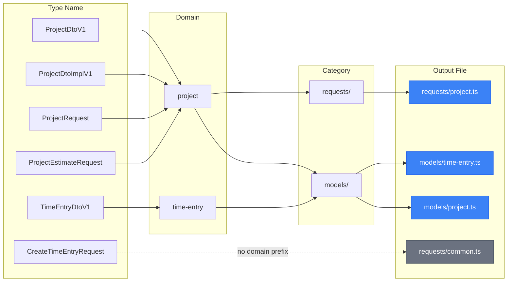
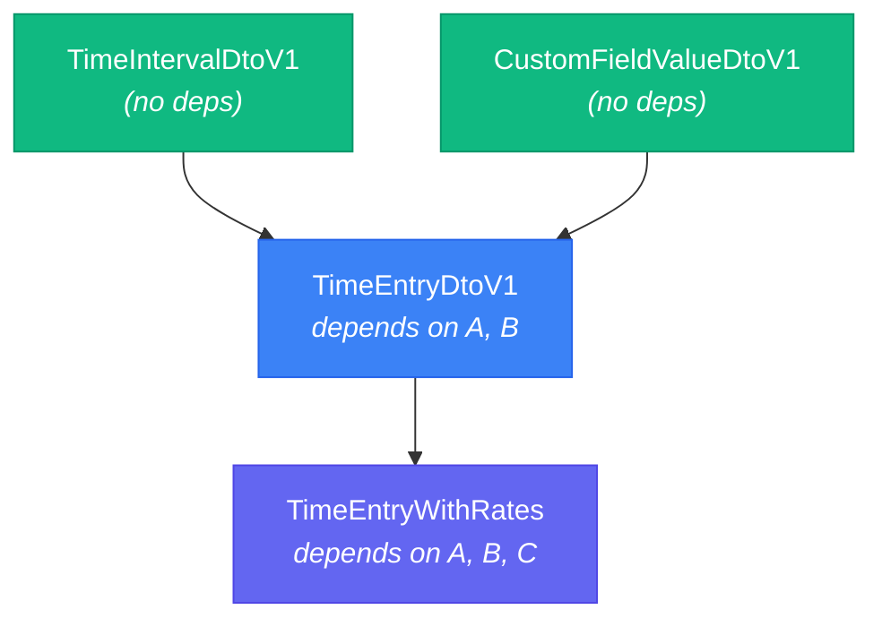

# Type Generation

The generator (`scripts/generate-types.ts`) is the heart of Clockifixed's type system. It reads Clockify's OpenAPI spec and produces a complete, well-organized set of TypeScript interfaces and Zod schemas.

## Pipeline Stages

## Name Resolution

The biggest challenge is Clockify's inconsistent naming. The spec has:

- `TimeEntryDtoImplV1` — an implementation detail DTO
- `TimeEntryDtoV1` — a V1-versioned DTO
- `TimeEntryDto` — a plain DTO

All three represent "time entry" shapes with different fields. The generator:

1. Strips suffixes (`DtoImplV1`, `DtoV1`, `Dto`, `V1`) to get an ideal name
2. Detects when multiple schemas map to the same ideal name
3. Falls back to preserving the raw OpenAPI name for colliding schemas
4. Uses the clean name when there's no collision

## Domain Grouping

Types are grouped into files by domain prefix:

## Topological Sort

Within each output file, schemas are sorted so that dependencies come before dependents:

For self-referencing schemas (like `GroupOne.children: GroupOne[]`), the generator wraps the Zod schema in `z.lazy()`.

## Output Statistics

| Metric | Count |
|---|---|
| Total schemas processed | 277 |
| TypeScript interfaces generated | 277 |
| Zod schemas generated | 277 |
| Model files | 27 |
| Request files | 16 |
| Filter files | 7 |
| Name collisions detected | 17 |
| Self-referencing schemas | 1 |
| Cross-file `z.lazy()` wraps | ~50+ |
